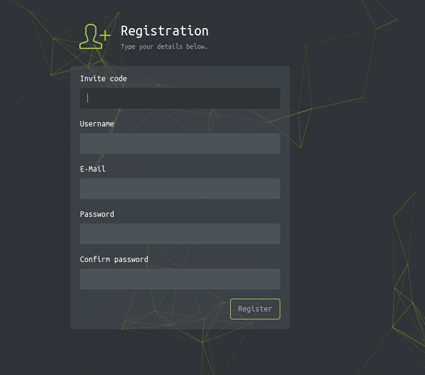
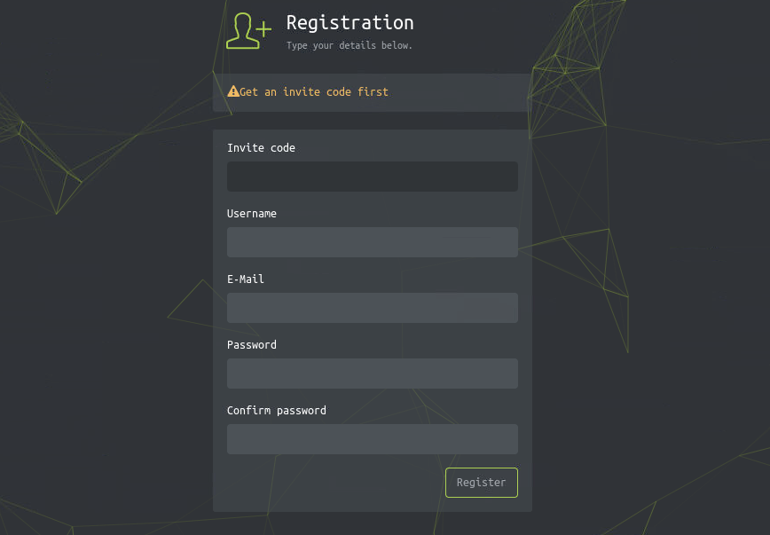
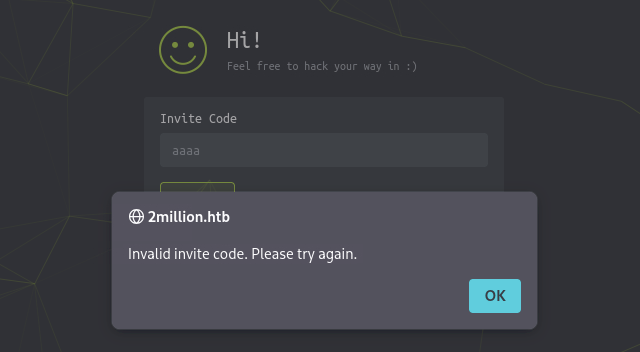
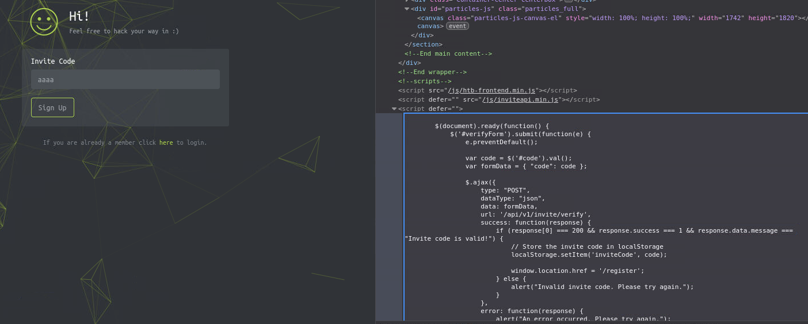
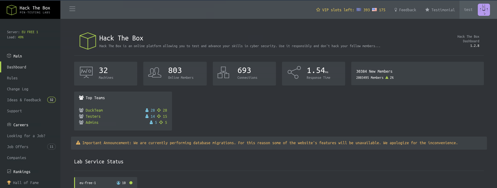

# TwoMillion Writeup

* Target IP: `10.129.229.66`

## 0-1. Reconnaissance – Nmap

I started with a full port scan using Nmap.

```bash
nmap -sC -sV -vv -p- 10.129.229.66
```

```text
22/tcp open  ssh     syn-ack OpenSSH 8.9p1 Ubuntu 3ubuntu0.1 (Ubuntu Linux; protocol 2.0)
| ssh-hostkey:
|   ...omitted
80/tcp open  http    syn-ack nginx
|_http-title: Did not follow redirect to http://2million.htb/
| http-methods:
|_  Supported Methods: GET HEAD POST OPTIONS
Service Info: OS: Linux; CPE: cpe:/o:linux:linux_kernel
```

Port 80 was open, and the web server redirected me to `http://2million.htb/`.

So I added the hostname to `/etc/hosts`.

```bash
echo "10.129.229.66 2million.htb" | sudo tee -a /etc/hosts
```

Then I visited the web page.


The page looked like an old Hack The Box landing page. I was not sure what it was at first.

There were many links in the header, but the only working one seemed to be `login`.


Furthermore, the `here` link on the page did not work either.

## 0-2. Reconnaissance – FFUF

I used FFUF to enumerate web paths.

```bash
ffuf -u http://2million.htb/FUZZ -w /usr/share/wordlists/seclists/Discovery/Web-Content/common.txt -fs 162
```

```text
404                     [Status: 200, Size: 1674, Words: 118, Lines: 46]
api                     [Status: 401, Size: 0, Words: 1, Lines: 1]
home                    [Status: 302, Size: 0, Words: 1, Lines: 1]
invite                  [Status: 200, Size: 3859, Words: 1363, Lines: 97]
login                   [Status: 200, Size: 3704, Words: 1365, Lines: 81]
logout                  [Status: 302, Size: 0, Words: 1, Lines: 1]
register                [Status: 200, Size: 4527, Words: 1512, Lines: 95]
```

The `invite` and `register` endpoints looked interesting.

## 1. Registration



I tried to register with random credentials, but the page showed this message:

```text
Get an invite code first
```



This strongly suggested that I needed to obtain an invite code before creating an account.

So I visited the `invite` endpoint.


The invite page had an input field.


I tried entering a random string.

The code `aaa` was obviously invalid, but the error message appeared through a JavaScript alert. That was interesting because it suggested that some invite logic might be implemented on the client side.



I inspected the JavaScript.



The script contained code like this:

```javascript
$.ajax({
    type: "POST",
    dataType: "json",
    data: formData,
    url: "/api/v1/invite/verify",
    ...

    localStorage.setItem("inviteCode", code);
});
```

I also found the file:

```text
/js/inviteapi.min.js
```

I used ChatGPT to beautify and understand the minified JavaScript.

```javascript
function verifyInviteCode(code) {
    var formData = {
        "code": code
    };

    $.ajax({
        type: "POST",
        dataType: "json",
        data: formData,
        url: "/api/v1/invite/verify",

        success: function(response) {
            console.log(response);
        },

        error: function(response) {
            console.log(response);
        }
    });
}

function makeInviteCode() {
    $.ajax({
        type: "POST",
        dataType: "json",
        url: "/api/v1/invite/how/to/generate",

        success: function(response) {
            console.log(response);
        },

        error: function(response) {
            console.log(response);
        }
    });
}
```

The `makeInviteCode()` function pointed to the following endpoint:

```text
/api/v1/invite/how/to/generate
```

I sent a POST request to it.

```bash
curl -s -X POST http://2million.htb/api/v1/invite/how/to/generate | jq .
```

```json
{
  "0": 200,
  "success": 1,
  "data": {
    "data": "Va beqre gb trarengr gur vaivgr pbqr, znxr n CBFG erdhrfg gb /ncv/i1/vaivgr/trarengr",
    "enctype": "ROT13"
  },
  "hint": "Data is encrypted ... We should probbably check the encryption type in order to decrypt it..."
}
```

The response said that the data was encrypted with ROT13.


Using CyberChef, I decoded it:

```text
In order to generate the invite code, make a POST request to /api/v1/invite/generate
```

So I sent another POST request to that endpoint.

```bash
curl -s -X POST http://2million.htb/api/v1/invite/generate | jq .
```

```json
{
  "0": 200,
  "success": 1,
  "data": {
    "code": "NFgwSjAtVlVLN0otREZFU0ktRU40UVQ=",
    "format": "encoded"
  }
}
```

The returned code looked like Base64, so I decoded it and used the invite code to register an account.

After registering, I was able to log in successfully.



## 2. Enumerating the API

Since the JavaScript revealed API endpoints, I started exploring the API.

I visited:

```text
http://2million.htb/api/v1
```


WIP...