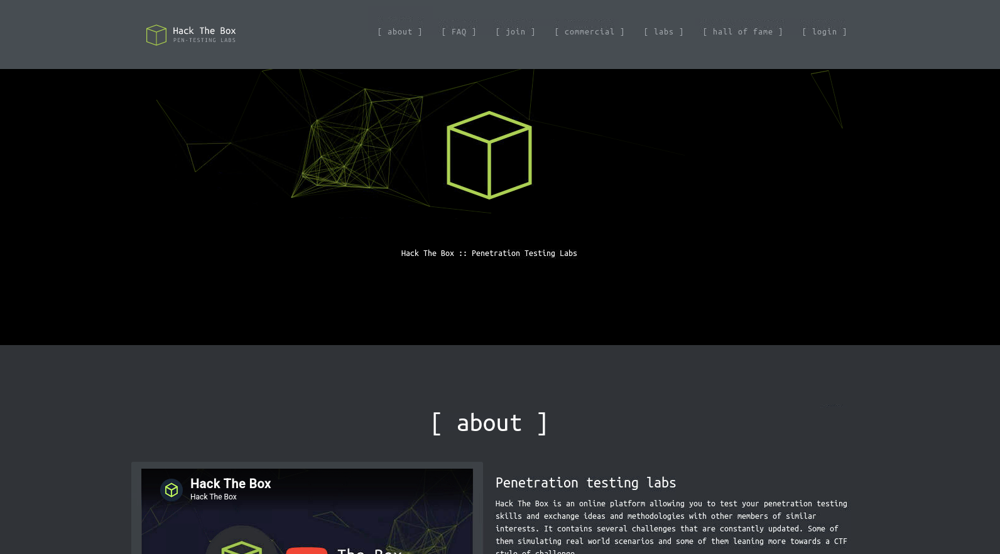
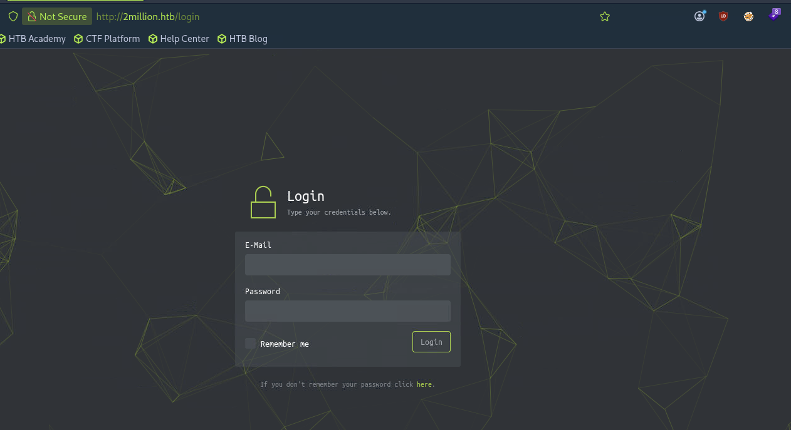
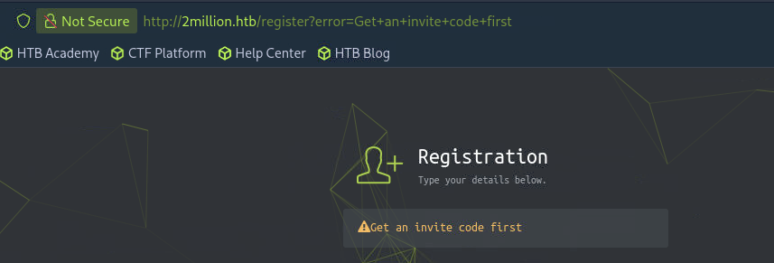
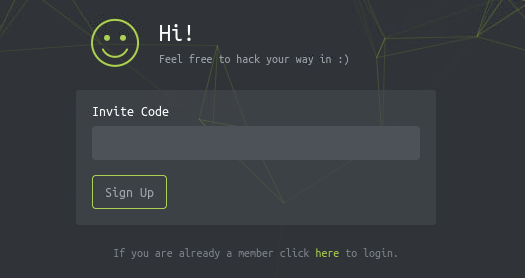
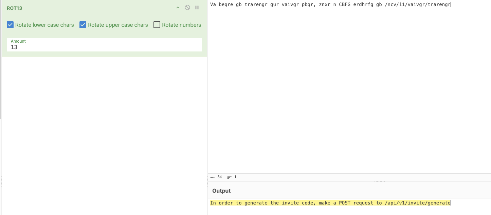
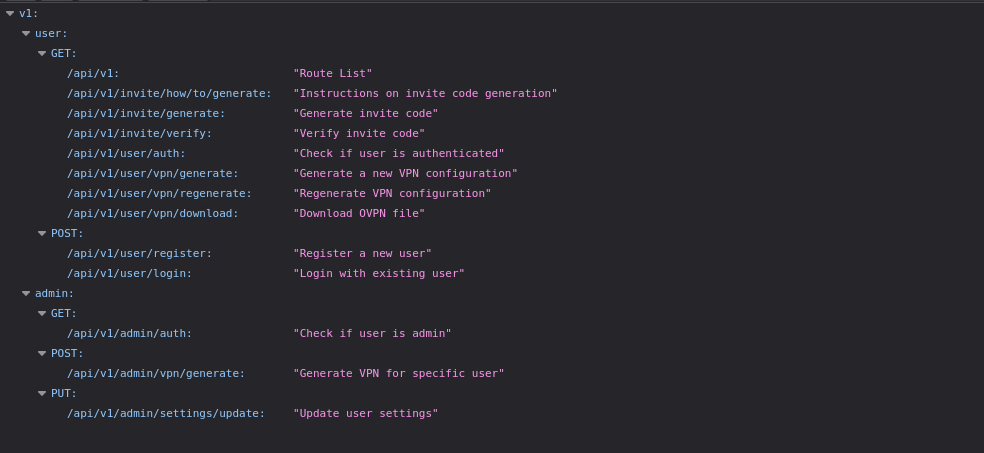

# TwoMillion WriteUp

* Target IP: `10.129.229.66`

## 0-1. Reconnaissance – Nmap

```
nmap -sC -sV -vv -p- 10.129.229.66
```

```
22/tcp open  ssh     syn-ack OpenSSH 8.9p1 Ubuntu 3ubuntu0.1 (Ubuntu Linux; protocol 2.0)
| ssh-hostkey: 
|   ...omitted
80/tcp open  http    syn-ack nginx
|_http-title: Did not follow redirect to http://2million.htb/
| http-methods: 
|_  Supported Methods: GET HEAD POST OPTIONS
Service Info: OS: Linux; CPE: cpe:/o:linux:linux_kernel
```

IP is resolved as "http://2million.htb/", so add it to /etc/hosts

```
echo "10.129.229.66 2million.htb" | sudo tee -a /etc/hosts
```

Visit 80.



Old Hack the box? I dont know.
On this page, many links on header, but valid link was only `login`.



Futhermore, `here` on this page doesnt work too.


## 0-2. Reconnaissance – FFUF


```
ffuf -u http://2million.htb/FUZZ -w /usr/share/wordlists/seclists/Discovery/Web-Content/common.txt -fs 162

404                     [Status: 200, Size: 1674, Words: 118, Lines: 46, Duration: 42ms]
api                     [Status: 401, Size: 0, Words: 1, Lines: 1, Duration: 33ms]
home                    [Status: 302, Size: 0, Words: 1, Lines: 1, Duration: 37ms]
invite                  [Status: 200, Size: 3859, Words: 1363, Lines: 97, Duration: 40ms]
login                   [Status: 200, Size: 3704, Words: 1365, Lines: 81, Duration: 40ms]
logout                  [Status: 302, Size: 0, Words: 1, Lines: 1, Duration: 33ms]
register                [Status: 200, Size: 4527, Words: 1512, Lines: 95, Duration: 41ms]
```

There is juicy endpoint `invite` and `register`.

## 1. Register


OK, It seems to be we need invite code by trying some credential randomly, and it shows the message `Get an invite code first`


As if being led, I visit `invite`.

By the way, what a funny way to make message.



Say hi to invite page.



Try some string into input box.
Obviously, the code `aaa` is invalid but the message is popped-up by Javascript alert. It is curious.


Yes, there is JS script, a possible hint.


It shows like below:

```javascript
 $.ajax({
    type: "POST",
    dataType: "json",
    data: formData,
    url: '/api/v1/invite/verify',
    ...

    localStorage.setItem('inviteCode', code);
```

And there is `/js/inviteapi.min.js`
I use ChatGPT to restorate.

```
function verifyInviteCode(code) {
    var formData = {
        "code": code
    };

    $.ajax({
        type: "POST",
        dataType: "json",
        data: formData,
        url: "/api/v1/invite/verify",

        success: function(response) {
            console.log(response);
        },

        error: function(response) {
            console.log(response);
        }
    });
}

function makeInviteCode() {
    $.ajax({
        type: "POST",
        dataType: "json",
        url: "/api/v1/invite/how/to/generate",

        success: function(response) {
            console.log(response);
        },

        error: function(response) {
            console.log(response);
        }
    });
}
```
This shows `makeInviteCode` make a code and that endpoint is `/api/v1/invite/how/to/generate`

Response of `curl -X POST http://2million.htb/api/v1/invite/how/to/generate` is json. Lets look it.

```
curl -s -X POST http://2million.htb/api/v1/invite/how/to/generate | jq .

{
  "0": 200,
  "success": 1,
  "data": {
    "data": "Va beqre gb trarengr gur vaivgr pbqr, znxr n CBFG erdhrfg gb /ncv/i1/vaivgr/trarengr",
    "enctype": "ROT13"
  },
  "hint": "Data is encrypted ... We should probbably check the encryption type in order to decrypt it..."
}
```

ROT13, OK.


 From CyberChef, the data means：
 
 > `In order to generate the invite code, make a POST request to /api/v1/invite/generate`

POST request to this endpoint.

```
curl -s -X POST http://2million.htb/api/v1/invite/generate | jq .
{
  "0": 200,
  "success": 1,
  "data": {
    "code": "NFgwSjAtVlVLN0otREZFU0ktRU40UVQ=",
    "format": "encoded"
  }
}
```
Maybe this is encoded by base64, decode it and set into localstorage, register, and login.

Successful login to web page.


## 2. Sniff around API
As we see api endpoint, we can sniff around api endpoints.

Browse `http://2million.htb/api/v1`.





