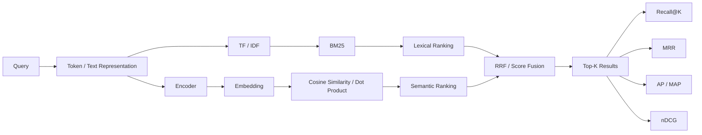
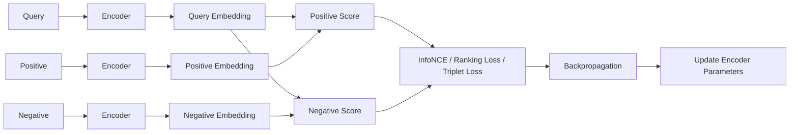
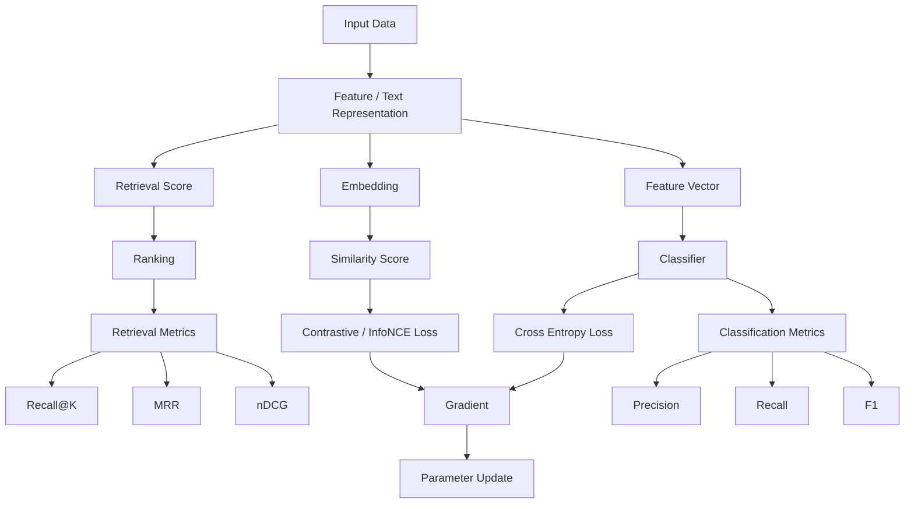

# Machine Learning & Information Retrieval Formula Cheat Sheet

> A compact reference for commonly used formulas in information retrieval, ranking, classification, embedding learning, evaluation, and preprocessing.
>
> **GitHub Markdown:** display formulas use fenced `math` blocks, code uses language-specific fences, and diagrams use `mermaid`.
>
> Format:
>
> - **Method**
> - **Formula**
> - **Quick note**

---

# 1. Retrieval / Information Retrieval

## Term Frequency (TF)

### Formula

```math
\mathrm{TF}(t,d)=f_{t,d}
```

or normalized:

```math
\mathrm{TF}(t,d)=\frac{f_{t,d}}{|d|}
```

### Quick note

- $f_{t,d}$: number of times term $t$ appears in document $d$
- $|d|$: document length
- Measures **how strongly a term appears inside one document**

---

## Inverse Document Frequency (IDF)

### Formula

A common form:

```math
\mathrm{IDF}(t)
=
\log\frac{N}{df(t)}
```

Smoothed form:

```math
\mathrm{IDF}(t)
=
\log\frac{N+1}{df(t)+1}+1
```

### Quick note

- $N$: total number of documents
- $df(t)$: number of documents containing term $t$
- Rare terms get larger weights

---

## TF-IDF

### Formula

```math
\mathrm{TFIDF}(t,d)
=
\mathrm{TF}(t,d)\cdot \mathrm{IDF}(t)
```

### Quick note

Balances:

```text
term frequency in this document
×
rarity across the corpus
```

---

## BM25

### Formula

```math
\begin{aligned}
\mathrm{BM25}(q,d)
&=
\sum_{t\in q}
\mathrm{IDF}(t)
\cdot
\frac{
f_{t,d}(k_1+1)
}{
f_{t,d}
+
k_1
\left(
1-b+b\frac{|d|}{\mathrm{avgdl}}
\right)
}
\end{aligned}
```

A common IDF form:

```math
\mathrm{IDF}(t)
=
\log\left(
\frac{N-df(t)+0.5}{df(t)+0.5}+1
\right)
```

### Quick note

- $f_{t,d}$: term frequency
- $N$: number of documents
- $df(t)$: document frequency
- $|d|$: document length
- $\mathrm{avgdl}$: average document length
- $k_1$: TF saturation strength
- $b$: document-length normalization strength

Typical defaults:

```math
k_1 \approx 1.2\sim2.0
```

```math
b \approx 0.75
```

BM25 improves TF-IDF mainly through:

```text
TF saturation
+
document length normalization
```

---

## Dot Product Score

### Formula

```math
s(\mathbf{x},\mathbf{y})
=
\mathbf{x}^{\top}\mathbf{y}
=
\sum_i x_i y_i
```

### Quick note

Large when vectors point in similar directions **and/or** have large magnitudes.

---

## Cosine Similarity

### Formula

```math
\cos(\mathbf{x},\mathbf{y})
=
\frac{
\mathbf{x}\cdot\mathbf{y}
}{
\|\mathbf{x}\|\|\mathbf{y}\|
}
```

### Quick note

Measures the angle between vectors.

```text
 1   -> same direction
 0   -> orthogonal
-1   -> opposite direction
```

For L2-normalized vectors:

```math
\|\mathbf{x}\|=\|\mathbf{y}\|=1
```

therefore:

```math
\cos(\mathbf{x},\mathbf{y})
=
\mathbf{x}\cdot\mathbf{y}
```

---

## Euclidean Distance

### Formula

```math
d(\mathbf{x},\mathbf{y})
=
\|\mathbf{x}-\mathbf{y}\|_2
=
\sqrt{
\sum_i (x_i-y_i)^2
}
```

### Quick note

Smaller means closer.

---

## Generic Weighted Score

### Formula

```math
S
=
w_1s_1+w_2s_2+\cdots+w_ns_n+b
```

or:

```math
S
=
\mathbf{w}^{\top}\mathbf{x}+b
```

### Quick note

Useful when combining several features or scores.

Example features:

```text
retrieval score
similarity score
exact-match flag
metadata match
```

---

## Reciprocal Rank Fusion (RRF)

### Formula

```math
\mathrm{RRF}(d)
=
\sum_{r\in R}
\frac{1}{k+\mathrm{rank}_r(d)}
```

### Quick note

- $R$: set of ranking systems
- $\mathrm{rank}_r(d)$: rank of document $d$ in ranking $r$
- $k$: smoothing constant, often $60$

RRF combines **ranks**, not raw scores.

---

# 2. Retrieval Evaluation

## Precision@K

### Formula

```math
\mathrm{Precision@K}
=
\frac{
\#\{\text{relevant documents in top }K\}
}{
K
}
```

### Quick note

Among the top $K$ retrieved items, how many are relevant?

---

## Recall@K

### Formula

```math
\mathrm{Recall@K}
=
\frac{
\#\{\text{relevant documents in top }K\}
}{
\#\{\text{all relevant documents}\}
}
```

### Quick note

How much of the relevant set was recovered within the top $K$?

---

## Reciprocal Rank (RR)

### Formula

```math
\mathrm{RR}
=
\frac{1}{
\mathrm{rank\ of\ first\ relevant\ result}
}
```

### Quick note

Examples:

```text
relevant at rank 1 -> 1.0
relevant at rank 2 -> 0.5
relevant at rank 5 -> 0.2
```

---

## Mean Reciprocal Rank (MRR)

### Formula

```math
\mathrm{MRR}
=
\frac{1}{|Q|}
\sum_{q\in Q}
\frac{1}{\mathrm{rank}_q}
```

### Quick note

Average reciprocal rank of the **first relevant result**.

---

## Average Precision (AP)

### Formula

```math
\mathrm{AP}
=
\frac{
\sum_{k=1}^{N}
\mathrm{Precision@k}\cdot \mathrm{rel}(k)
}{
\#\{\text{relevant documents}\}
}
```

where:

```math
\mathrm{rel}(k)
=
\begin{cases}
1 & \text{if result at rank }k\text{ is relevant}\\
0 & \text{otherwise}
\end{cases}
```

### Quick note

Precision is counted only at ranks where a relevant result appears.

---

## AP@K

### Formula

```math
\mathrm{AP@K}
=
\frac{
\sum_{k=1}^{K}
\mathrm{Precision@k}\cdot \mathrm{rel}(k)
}{
\min(K,R)
}
```

where $R$ is the number of relevant documents.

### Quick note

AP limited to the first $K$ ranks.

---

## Mean Average Precision (MAP)

### Formula

```math
\mathrm{MAP}
=
\frac{1}{|Q|}
\sum_{q\in Q}
\mathrm{AP}(q)
```

### Quick note

Average AP across all queries.

---

## Discounted Cumulative Gain (DCG)

### Formula

A common form:

```math
\mathrm{DCG@K}
=
\sum_{i=1}^{K}
\frac{2^{rel_i}-1}{\log_2(i+1)}
```

### Quick note

Relevant documents receive more credit when they appear near the top.

Supports **graded relevance**.

---

## Ideal DCG (IDCG)

### Formula

```math
\mathrm{IDCG@K}
=
\mathrm{DCG@K}
```

computed using the ideal relevance ordering.

### Quick note

The best possible DCG for the query.

---

## Normalized DCG (nDCG)

### Formula

```math
\mathrm{nDCG@K}
=
\frac{
\mathrm{DCG@K}
}{
\mathrm{IDCG@K}
}
```

### Quick note

Usually:

```math
0\le \mathrm{nDCG@K}\le1
```

Higher is better.

---

# 3. Linear Models / Classification

## Linear Score

### Formula

```math
z
=
\mathbf{w}^{\top}\mathbf{x}+b
```

For multiple classes:

```math
\mathbf{z}
=
W\mathbf{x}+\mathbf{b}
```

### Quick note

- $\mathbf{x}$: input features
- $W,\mathbf{w}$: learned weights
- $b$: bias
- $\mathbf{z}$: logits / raw scores

---

## Logistic Sigmoid

### Formula

```math
\sigma(z)
=
\frac{1}{1+e^{-z}}
```

### Quick note

Maps a scalar logit to:

```math
0 < \sigma(z) < 1
```

Often used for binary classification.

---

## Softmax

### Formula

```math
p_i
=
\frac{
e^{z_i}
}{
\sum_j e^{z_j}
}
```

### Quick note

Turns logits into a probability distribution:

```math
\sum_i p_i=1
```

Stable implementation uses:

```math
z_i' = z_i-\max_j z_j
```

before exponentiation.

---

## Cross Entropy

For one-hot target $y_i$:

### Formula

```math
L
=
-\sum_i y_i\log p_i
```

If the correct class is $c$:

```math
L
=
-\log p_c
```

### Quick note

High probability on the correct class:

```text
small loss
```

Low probability on the correct class:

```text
large loss
```

---

## Binary Cross Entropy

### Formula

```math
L
=
-
\left[
y\log p
+
(1-y)\log(1-p)
\right]
```

### Quick note

Used for binary classification.

---

## Softmax + Cross Entropy Gradient

### Formula

```math
\frac{\partial L}{\partial z_i}
=
p_i-y_i
```

Vector form:

```math
\nabla_{\mathbf{z}}L
=
\mathbf{p}-\mathbf{y}
```

### Quick note

A very useful result:

```text
predicted probability
-
correct label
```

---

## Linear Layer Gradient

If:

```math
\mathbf{z}=W\mathbf{x}+\mathbf{b}
```

and:

```math
\boldsymbol{\delta}
=
\frac{\partial L}{\partial \mathbf{z}}
```

then:

```math
\frac{\partial L}{\partial W}
=
\boldsymbol{\delta}\mathbf{x}^{\top}
```

```math
\frac{\partial L}{\partial \mathbf{b}}
=
\boldsymbol{\delta}
```

### Quick note

Connects classification loss to weight updates.

---

# 4. Classification Evaluation

## Accuracy

### Formula

```math
\mathrm{Accuracy}
=
\frac{TP+TN}{
TP+TN+FP+FN
}
```

### Quick note

Fraction of all predictions that are correct.

---

## Precision

### Formula

```math
\mathrm{Precision}
=
\frac{TP}{TP+FP}
```

### Quick note

Among predicted positives, how many were truly positive?

---

## Recall

### Formula

```math
\mathrm{Recall}
=
\frac{TP}{TP+FN}
```

### Quick note

Among actual positives, how many were found?

---

## F1 Score

### Formula

```math
F_1
=
2
\frac{
\mathrm{Precision}\cdot\mathrm{Recall}
}{
\mathrm{Precision}+\mathrm{Recall}
}
```

### Quick note

Harmonic mean of Precision and Recall.

---

## Confusion Matrix

### Form

```math
\begin{bmatrix}
TN & FP\\
FN & TP
\end{bmatrix}
```

### Quick note

Useful for understanding **what type of mistakes** the classifier makes.

---

# 5. Embedding / Contrastive Learning

## Embedding Similarity Score

### Generic Form

```math
s(q,d)
=
\mathrm{sim}
\left(
f_\theta(q),
f_\theta(d)
\right)
```

### Quick note

- $f_\theta$: encoder
- $q$: query
- $d$: document / candidate
- similarity may be cosine similarity or dot product

---

## InfoNCE

### Formula

For one positive and multiple negatives:

```math
\begin{aligned}
L
&=
-\log
\frac{
\exp\left(s(q,d^+)/\tau\right)
}{
\exp\left(s(q,d^+)/\tau\right)
+
\sum_i
\exp\left(s(q,d_i^-)/\tau\right)
}
\end{aligned}
```

Equivalent denominator notation:

```math
L
=
-\log
\frac{
\exp(s^+/\tau)
}{
\sum_j \exp(s_j/\tau)
}
```

### Quick note

Encourages:

```math
s(q,d^+) \uparrow
```

and:

```math
s(q,d^-) \downarrow
```

---

## Temperature

### Formula inside Softmax / InfoNCE

```math
\frac{s}{\tau}
```

### Quick note

Small $\tau$:

```text
sharper distribution
score differences emphasized
```

Large $\tau$:

```text
smoother distribution
score differences softened
```

---

## Margin Ranking Loss

### Formula

```math
L
=
\max
\left(
0,
m-s^++s^-
\right)
```

Target condition:

```math
s^+
\ge
s^-+m
```

### Quick note

If positive and negative scores are too close, loss becomes positive.

---

## Triplet Loss

### Distance Form

```math
L
=
\max
\left(
0,
d(a,p)-d(a,n)+m
\right)
```

### Quick note

- $a$: anchor
- $p$: positive
- $n$: negative
- $m$: margin

Goal:

```text
anchor-positive distance
<
anchor-negative distance
```

by at least the margin.

---

## Hard Negative

### Concept

A hard negative is not a separate loss function.

It is a negative sample such that:

```math
s(q,d^-_{\mathrm{hard}})
```

is relatively high.

### Quick note

```text
easy negative
-> obviously unrelated

hard negative
-> looks similar but is still incorrect
```

Hard negatives usually produce stronger training signals.

---

## In-Batch Negatives

### Concept

For a batch:

```math
(q_1,d_1^+),\dots,(q_B,d_B^+)
```

the other positive documents can be reused as negatives.

For query $q_i$:

```math
d_j^+, \quad j\ne i
```

act as negatives.

### Quick note

Efficient way to obtain many negatives without explicitly storing them.

---

# 6. Optimization

## Loss Function

### Generic Form

```math
L(\theta)
```

### Quick note

Measures how bad the current model parameters $\theta$ are.

Training aims to minimize:

```math
\min_\theta L(\theta)
```

---

## Gradient

### Formula

```math
\nabla_\theta L
=
\left[
\frac{\partial L}{\partial \theta_1},
\frac{\partial L}{\partial \theta_2},
\dots
\right]
```

### Quick note

Points in the direction of the steepest increase in loss.

---

## Gradient Descent

### Formula

```math
\theta
\leftarrow
\theta
-
\eta
\nabla_\theta L
```

### Quick note

- $\eta$: learning rate
- Move parameters in the opposite direction of the gradient

---

## Learning Rate

### Symbol

```math
\eta
```

### Quick note

Too small:

```text
slow learning
```

Too large:

```text
unstable / overshooting
```

---

# 7. Basic Statistics / Preprocessing

## Mean

### Formula

```math
\mu
=
\frac{1}{N}
\sum_{i=1}^{N}x_i
```

### Quick note

Average value.

---

## Variance

### Population Variance

```math
\sigma^2
=
\frac{1}{N}
\sum_{i=1}^{N}
(x_i-\mu)^2
```

### Quick note

Measures spread around the mean.

---

## Standard Deviation

### Formula

```math
\sigma
=
\sqrt{\sigma^2}
```

### Quick note

Variance expressed in the original unit.

---

## Standardization / Z-score

### Formula

```math
z
=
\frac{x-\mu}{\sigma}
```

### Quick note

Transforms a feature into:

```text
distance from the mean
measured in standard deviations
```

Standardize **feature by feature**.

---

## Min-Max Scaling

### Formula

```math
x'
=
\frac{
x-x_{\min}
}{
x_{\max}-x_{\min}
}
```

### Quick note

Usually maps values to:

```math
[0,1]
```

---

## L2 Norm

### Formula

```math
\|\mathbf{x}\|_2
=
\sqrt{
\sum_i x_i^2
}
```

### Quick note

Length of a vector.

---

## L2 Normalization

### Formula

```math
\hat{\mathbf{x}}
=
\frac{
\mathbf{x}
}{
\|\mathbf{x}\|_2
}
```

### Quick note

After normalization:

```math
\|\hat{\mathbf{x}}\|_2=1
```

Frequently used before cosine similarity.

---

# 8. Common Mathematical Patterns

## Weighted Sum

```math
z
=
\sum_i w_i x_i+b
```

Used in:

```text
linear models
classifiers
ranking scores
neural network layers
```

---

## Exponential Normalization

```math
p_i
=
\frac{e^{z_i}}
{\sum_j e^{z_j}}
```

Used in:

```text
Softmax
InfoNCE
classification
contrastive learning
```

---

## Log Loss Pattern

```math
L=-\log p
```

Used in:

```text
Cross Entropy
InfoNCE
negative log likelihood
```

Interpretation:

```text
correct event gets high probability
-> low loss
```

---

## Margin Pattern

```math
L
=
\max(0,m+\text{bad}-\text{good})
```

Used in:

```text
Margin Ranking Loss
Triplet Loss
pairwise ranking
```

---

# 9. Relationship Diagram — Retrieval



---

# 10. Relationship Diagram — Classification


---

# 11. Relationship Diagram — Embedding Learning



---

# 12. Relationship Diagram — Overall Learning Pipeline



---

# 13. Quick Formula Index

## Retrieval

```math
\mathrm{TF}(t,d)=f_{t,d}
```

```math
\mathrm{IDF}(t)=\log\frac{N}{df(t)}
```

```math
\mathrm{TFIDF}=\mathrm{TF}\cdot\mathrm{IDF}
```

```math
\mathrm{BM25}(q,d)
=
\sum_{t\in q}
\mathrm{IDF}(t)
\frac{
f_{t,d}(k_1+1)
}{
f_{t,d}
+
k_1
\left(
1-b+b\frac{|d|}{\mathrm{avgdl}}
\right)
}
```

```math
\cos(\mathbf{x},\mathbf{y})
=
\frac{
\mathbf{x}\cdot\mathbf{y}
}{
\|\mathbf{x}\|\|\mathbf{y}\|
}
```

```math
\mathrm{RRF}(d)
=
\sum_r
\frac{1}{
k+\mathrm{rank}_r(d)
}
```

---

## Retrieval Metrics

```math
\mathrm{Precision@K}
=
\frac{\#\text{ relevant in top K}}{K}
```

```math
\mathrm{Recall@K}
=
\frac{\#\text{ relevant in top K}}{\#\text{ all relevant}}
```

```math
\mathrm{MRR}
=
\frac{1}{|Q|}
\sum_q
\frac{1}{\mathrm{rank}_q}
```

```math
\mathrm{nDCG@K}
=
\frac{
\mathrm{DCG@K}
}{
\mathrm{IDCG@K}
}
```

---

## Classification

```math
z
=
\mathbf{w}^{\top}\mathbf{x}+b
```

```math
p_i
=
\frac{e^{z_i}}{\sum_j e^{z_j}}
```

```math
L_{\mathrm{CE}}
=
-\sum_i y_i\log p_i
```

```math
\frac{\partial L}{\partial z_i}
=
p_i-y_i
```

---

## Contrastive Learning

```math
L_{\mathrm{InfoNCE}}
=
-\log
\frac{
\exp(s^+/\tau)
}{
\sum_j\exp(s_j/\tau)
}
```

```math
L_{\mathrm{margin}}
=
\max(0,m-s^++s^-)
```

```math
L_{\mathrm{triplet}}
=
\max(0,d(a,p)-d(a,n)+m)
```

---

## Optimization

```math
\theta
\leftarrow
\theta-\eta\nabla_\theta L
```

---

## Preprocessing

```math
\mu
=
\frac{1}{N}\sum_i x_i
```

```math
\sigma^2
=
\frac{1}{N}
\sum_i(x_i-\mu)^2
```

```math
z
=
\frac{x-\mu}{\sigma}
```

```math
\hat{\mathbf{x}}
=
\frac{\mathbf{x}}{\|\mathbf{x}\|_2}
```

---

# 14. Minimal Mental Map

```text
Retrieval:
text
-> score
-> rank
-> Recall@K / MRR / nDCG

Classification:
features
-> Wx + b
-> Softmax
-> Cross Entropy
-> Gradient
-> parameter update

Embedding learning:
text
-> encoder
-> embedding
-> similarity score
-> InfoNCE / ranking loss
-> gradient
-> encoder update

Preprocessing:
raw feature
-> standardization / normalization
-> model input
```
